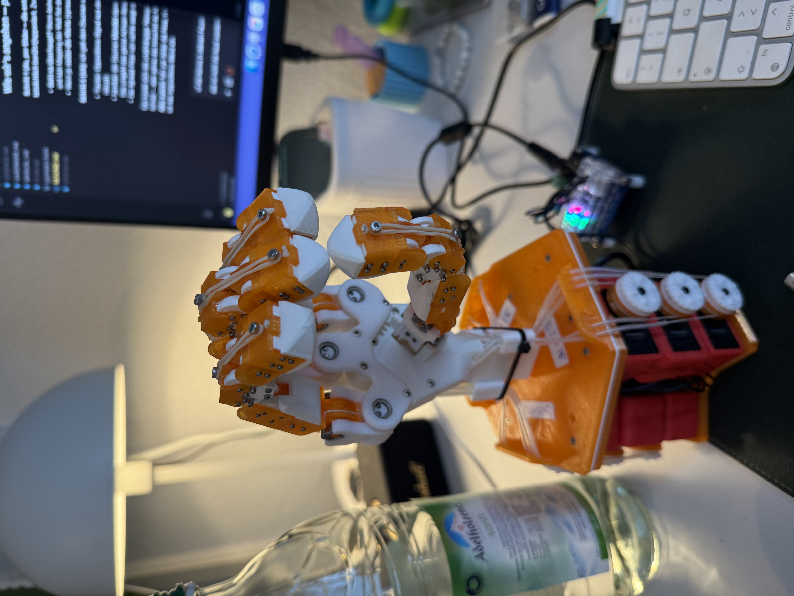
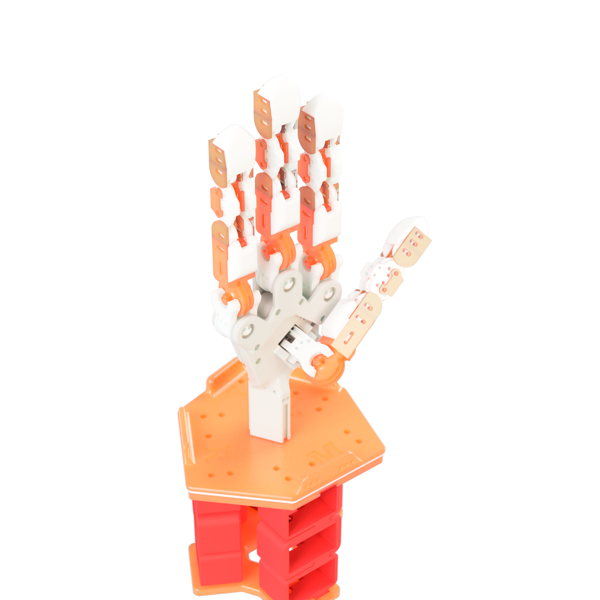
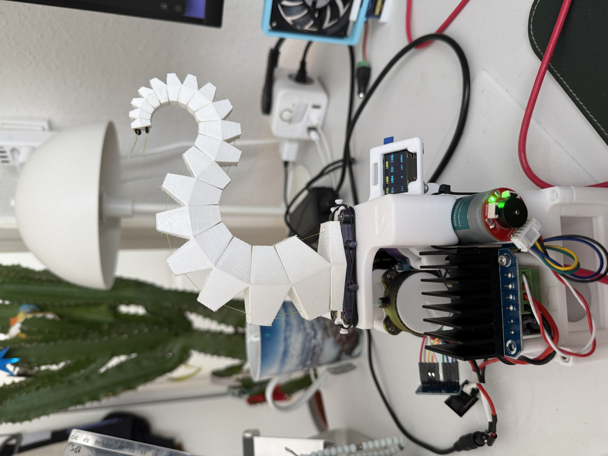

# handlab-hardware

Physical build material for the tendon-driven claw hands controlled by
[handlab](https://github.com/michiqn/handlab), the software side (control center + live MuJoCo
digital twin).

  
  &nbsp;
  

> **Work in progress.** Printable parts, bill of materials and an assembly guide are still to come
> (see [TODO](#todo)).

## The hands

| Version | Fingers | Servos | Status |
|---------|---------|--------|--------|
| **v1** — 3-finger claw | thumb · index · mid | 9 × Dynamixel XL330-M288-T | working, first verified grasp |
| **v2** — 4-finger hand | thumb · index · mid · ring | 12 × Dynamixel XL330-M288-T | working |

Each finger has 3 servos → 3 DOFs: `spread`, `flex` and `curl` (one tendon drives the coupled
PIP/DIP joints). The servos sit in the stacked base and drive the fingers through tendons routed
in PTFE tubing.

## Contents

| Path | What |
|------|------|
| `cad/4_finger_assembled.stl` | the assembled 4-finger hand (single mesh, for viewing) |
| `cad/motor_handle.stl` | motor handle part |
| `cad/kraqn_case.stl` | KraQn's base / case (own design) |
| `photos/hand_4finger_v2.JPG` | v2, the 4-finger hand |
| `photos/whatever_pose.JPG` | v2 in a pose |
| `photos/4_finger_ptfe_tubing.JPG` | v2, open, showing the PTFE tendon tubing |
| `photos/4_finger_render.png` | render of v2 |
| `photos/hand_3finger_v1.jpg` | v1, the 3-finger claw |
| `photos/KraQn.JPG` | KraQn, my first robotic gripper (see below) |
| `GIFs/4finger_gif.mp4` | short clip of v2 moving (MP4, ~2 s) |

All photos are published without location metadata (see the notes in `.gitignore` before adding
more).

## KraQn — the first gripper

**KraQn** was my first robotic gripper and where this project started: a 2-tendon
logarithmic-spiral arm after the **SpiRobs** paper (see Credits). The spiral arm design comes from
SpiRobs; the body, the motor base and all of the electronics I designed and built myself, which is
where I learned soldering and the rest of the hardware basics.

The base/case is in [`cad/kraqn_case.stl`](cad/kraqn_case.stl).

**Next:** a 3-tendon version, when time allows.

 

## TODO

- [ ] Printable parts (STL/3MF per part) + print settings
- [ ] Bill of materials (Dynamixel XL330 servos, U2D2, power hub, tendon, PTFE tubing, bearings, fasteners)
- [ ] Assembly + tendon-routing guide
- [ ] Wiring (servo IDs per finger — see `handlab/builds/*.yaml` in the software repo)
- [ ] License for the own parts (not chosen yet)

## Credits

- **CRAFT hand** — L. Lin, S. Patel, J. Moon, S. Lazebnik, U. Jain (UIUC / UC Irvine).
  The finger models are derived from CRAFT (MIT, see [`LICENSE-CRAFT`](LICENSE-CRAFT)).
  Paper: [arXiv:2603.12120](https://arxiv.org/abs/2603.12120) · code/CAD: <https://github.com/craft-hand>
- **ORCA Hand** by ORCA Dexterity, Inc. (ETH Zürich Soft Robotics Lab) — CC BY 4.0 — the
  ratchet-spool tendon tensioning idea. <https://github.com/orcahand/orcahand_hardware>
- **SpiRobs** — Z. Wang, N. M. Freris, X. Wei, *SpiRobs: Logarithmic spiral-shaped robots for
  versatile grasping across scales*, Device (2024),
  [doi:10.1016/j.device.2024.100646](https://doi.org/10.1016/j.device.2024.100646) ·
  [arXiv:2303.09861](https://arxiv.org/abs/2303.09861) — the idea and the spiral arm of KraQn.
  Their open design files ([Open-Spiral-Robots](https://github.com/ZhanchiWang/Open-Spiral-Robots))
  are licensed for **non-commercial use only** (PolyForm Noncommercial 1.0.0).
- Palm, base and stand of the hands, and KraQn's body, base and electronics: own design.
